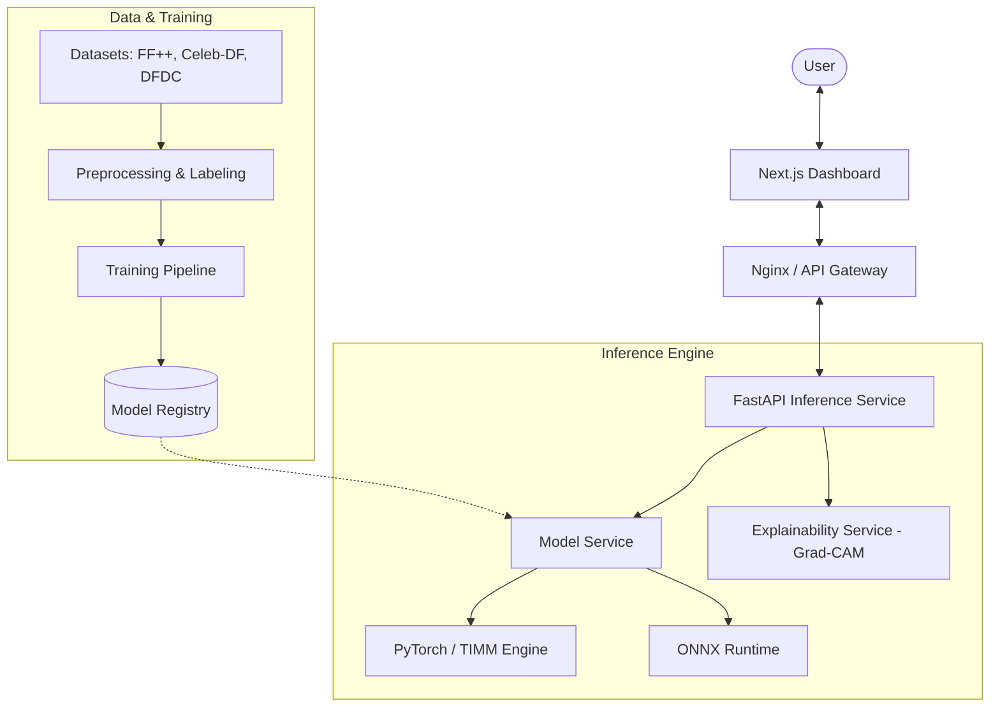

# 🛡️ RealFake Detection Platform

[](https://opensource.org/licenses/MIT)
[](https://www.python.org/downloads/)
[](https://fastapi.tiangolo.com)
[](https://nextjs.org)
[](https://pytorch.org)

> **Empowering Truth in the Digital Age.** A comprehensive, production-ready suite for detecting deepfakes in images and videos using state-of-the-art Deep Learning and Explainable AI (XAI).

---

## ✨ Key Features

- **🖼️ Multi-Media Detection**: Seamlessly detect deepfakes in both high-resolution images and long-form videos.
- **🔍 Explainable AI (XAI)**: Integrated **Grad-CAM** visualizations highlight exactly *why* the model flagged a specific region as "Fake".
- **🚀 Production-Ready API**: High-performance FastAPI backend with rate-limiting, authentication, and async processing.
- **📊 Interactive Dashboard**: Modern Next.js frontend with real-time prediction updates and detailed report generation.
- **🛠️ Robust ML Pipeline**: Complete lifecycle support from data acquisition (FaceForensics++, Celeb-DF, DFDC) to model training and evaluation.
- **📦 Edge & Deployment**: Optimized for cloud (Docker/K8s) and edge environments (Mobile/Browser Extensions).

---

## 🏗️ System Architecture



---

## 🚀 Quick Start

### 1. Prerequisites
- Python 3.9+
- Node.js 18+
- Docker (Optional)

### 2. Installation

```bash
# Clone the repository
git clone https://github.com/your-username/realfake-detection.git
cd realfake-detection

# Set up the Backend
python -m venv .venv
source .venv/bin/activate  # Or .venv\Scripts\activate on Windows
pip install -r app/backend/requirements.txt

# Set up the Frontend
cd app/frontend
npm install
```

### 3. Running Locally

**Start the Backend:**
```bash
cd app/backend
uvicorn main:app --reload --port 8000
```

**Start the Frontend:**
```bash
cd app/frontend
npm run dev
```

Visit `http://localhost:3000` to access the dashboard.

---

## 🛠️ Automation Scripts

For convenience, use the following scripts to manage the project:

- **`start.ps1`**: Automatically sets up the environment (Python venv, npm install) and launches both services.
- **`stop.ps1`**: Instantly stops both the backend and frontend by clearing their respective ports (8000 & 3000).

```powershell
# Run the start script
.\start.ps1

# Run the stop script
.\stop.ps1
```

---

## 🧪 Explainability (Grad-CAM)

Understanding the "Black Box" is critical for trust. Our platform provides heatmaps that visualize the attention of the neural network.

The system identifies manipulation artifacts such as:
- Inconsistent lighting and shadows.
- Blending boundaries around the eyes and mouth.
- Facial symmetry anomalies and "jitter" in video frames.

---

## 📂 Project Structure

```text
├── app/
│   ├── backend/          # FastAPI Inference API
│   ├── frontend/         # Next.js UI Dashboard
│   └── deployment/       # Docker, K8s, and Nginx configs
├── training/             # Training scripts and model architectures
├── evaluation/           # Performance metrics and test suites
├── preprocessing/        # Data augmentation and face extraction
├── data/                 # Dataset download and labeling utilities
└── edge/                 # Mobile and Browser-extension runtimes
```

---

## 📚 Supported Datasets

The platform includes automated scripts to download and format the following industry-standard datasets:
- **FaceForensics++**: Multi-level manipulation detection.
- **Celeb-DF (V2)**: High-quality celebrity deepfakes.
- **DFDC**: DeepFake Detection Challenge dataset.
- **Custom**: Support for user-provided datasets via structured labeling.

---

## 🛡️ Security & Scalability

- **Rate Limiting**: Protect your API from abuse via configurable middleware.
- **Telemetry**: Integrated Prometheus metrics for real-time monitoring.
- **Dockerized**: Single-command deployment using `docker compose up --build`.
- **Hardened**: Production-grade Nginx reverse proxy configurations included.

---

## 🤝 Contributing

We welcome contributions! 

1. Fork the Project
2. Create your Feature Branch (`git checkout -b feature/AmazingFeature`)
3. Commit your Changes (`git commit -m 'Add some AmazingFeature'`)
4. Push to the Branch (`git push origin feature/AmazingFeature`)
5. Open a Pull Request

---

## 📄 License

Distributed under the MIT License. See `LICENSE` for more information.

---

<p align="center">
  Built with ❤️ by the RealFake Team
</p>
